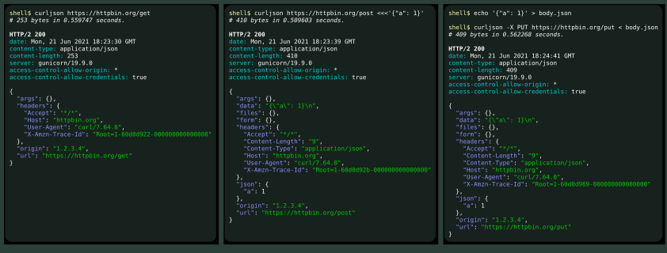

# curljson

Wrapper to use JSON with [curl](https://curl.se/).

---



---

## Installation

Copy the [`curljson`](./curljson) to any directory in your `$PATH` variable.

You need [jq](https://stedolan.github.io/jq/) and a recent version of curl. The
tool was tested with curl 7.64.

## Usage

```console
$ curljson [options] URL

$ curljson [options] URL < body.json

$ curljson [options] URL <<<'{"json": "object"}'
```

You can use any [curl option](https://curl.se/docs/manpage.html) with `curljson`.

Data received in the *stdin* (like `< body.json`) will be sent as a JSON object
in the request body.
